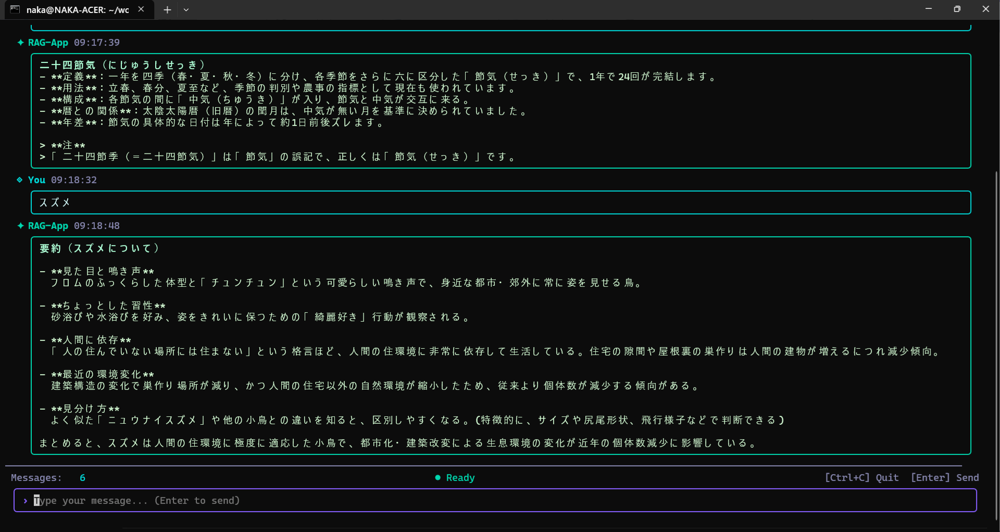

# node_tui_rag_4

 Version: 0.9.1

 Author  :

 date    : 2026/06/25

 update : 2026/07/17 

***

node.js C++ , Ink TUI RAG SQLite OpenRouter

* OpenRouter
* embedding : Gemini-embedding-001
* node 22
* LLVM CLang
* Linux

***
### related

https://openrouter.ai/

https://openrouter.ai/models

***
## Image

* RAG APP



***
* LIB add
```
sudo apt install uuid-dev
sudo apt install nlohmann-json3-dev
sudo apt install libsqlite3-dev
sudo apt install libcurl4-openssl-dev
```

***
* table add
```
sqlite3 ./example.db < table.sql
```
***
* .env

```
OPENROUTER_API_KEY=
OPENROUTER_MODEL=deepseek/deepseek-v4-flash
GEMINI_API_KEY=
```

***
* C++ build
```
clang++ -std=c++17 -o embed embed.cpp -lsqlite3 -lcurl -luuid
make all
```

* embed
```
./embed ./data
```
***
* node start
```
npm i
npm run start
```

***
* End
* Ctrl + C

***
### blog

https://zenn.dev/knaka0209/scraps/6faad25e64cf4c

